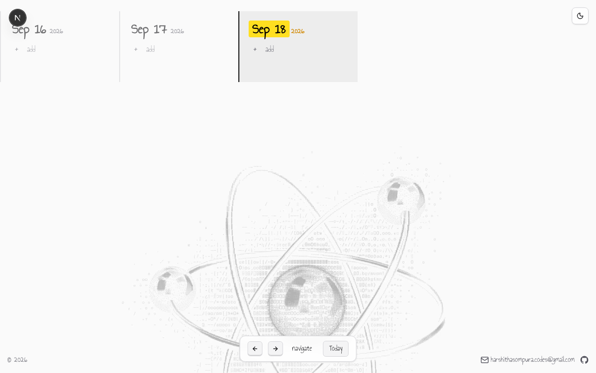
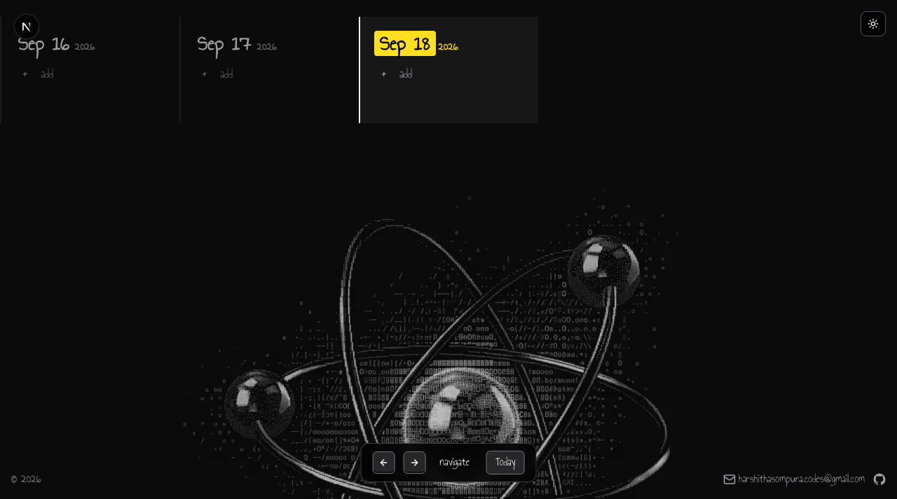

# Todos

A quiet log of days. Scroll through a rolling calendar, jot todos on each day, check them off with a scribble.

Built with Next.js 16, Tailwind v4, and localStorage — no backend, no accounts.

## Screenshots

### Light



### Dark



## Features

- Scroll or arrow-key through the last 60 days
- Add / check / delete todos per day, saved in localStorage
- Light / dark theme, remembered across sessions
- Scribble sound when a todo is checked off
- Handwritten look via the *Annie Use Your Telescope* font

## Run locally

```bash
pnpm install
pnpm dev
```

Open http://localhost:3000.

## Stack

- Next.js 16 (App Router, Turbopack)
- React 19
- Tailwind CSS v4
- lucide-react

## Author

Harshitha Sompura — [harshithasompura.codes@gmail.com](mailto:harshithasompura.codes@gmail.com) · [github.com/harshithasompura](https://github.com/harshithasompura)
